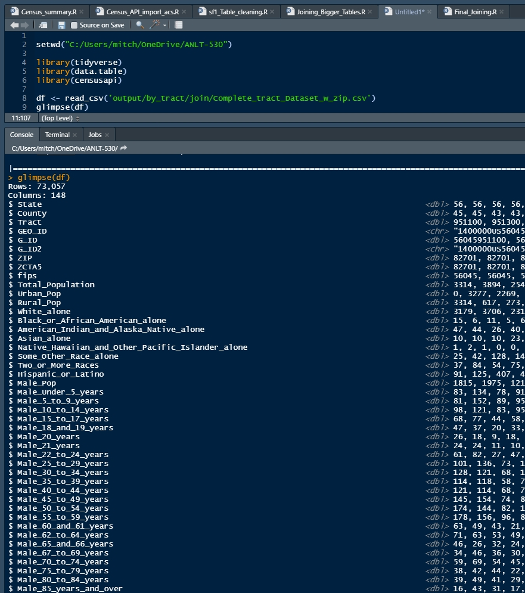
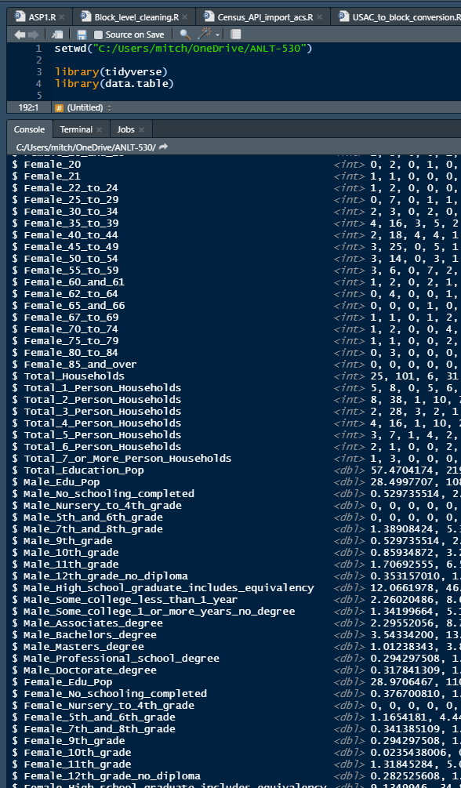
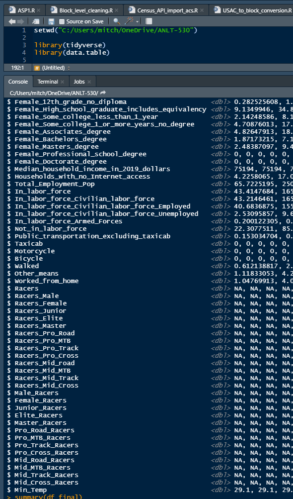
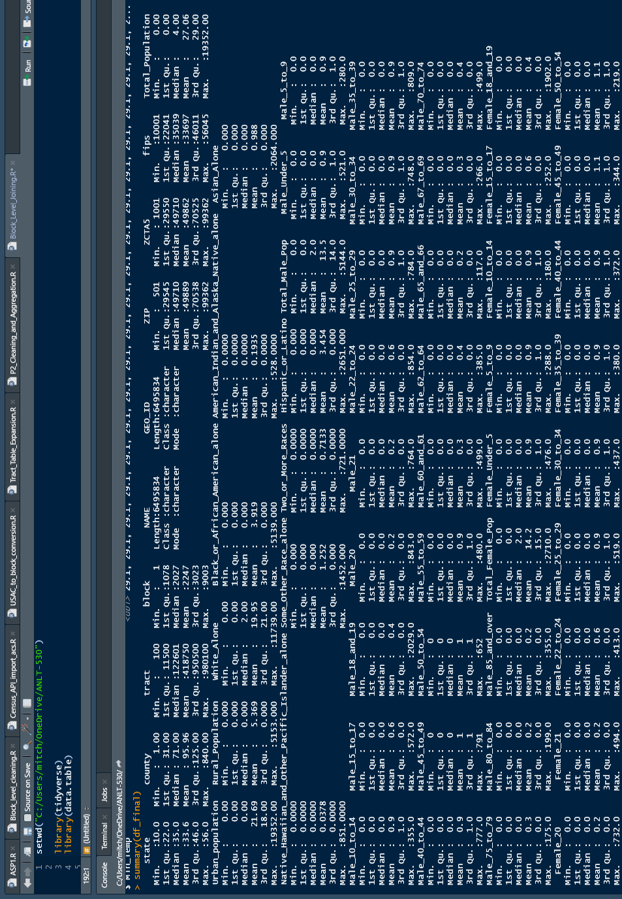
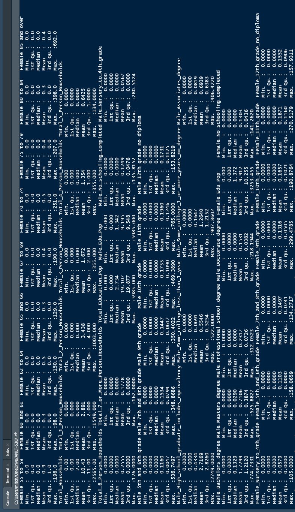
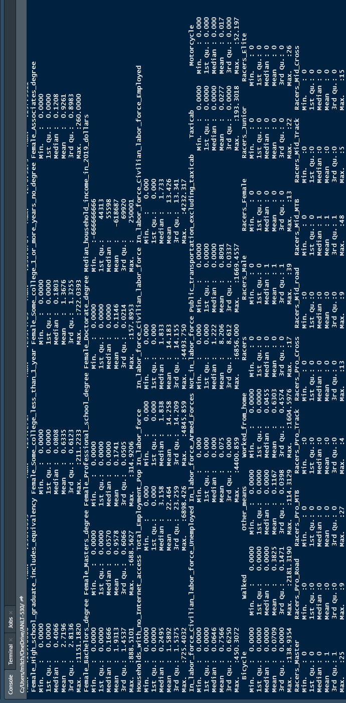
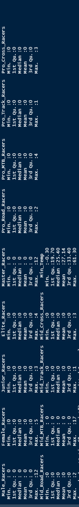

```{r setup, include=FALSE}
knitr::opts_chunk$set(echo = TRUE)
```

## Objective

The goal of this portion of the project was to obtain a "big data" dataset compiled around United States Census Bureau data. The dataset was to be compiled at the Zip or Zip+4 level, and use 10 year census data as the foundation with additional 5 and/or 1 year census data added if it appeared to be useful.  Additional data from outside sources could also be added to the base data if it proved useful.

## Methodology

The base data set for this was acquired from the US Census Bureau using their api.  R code was written to download the data tables shown below:

#### 10 Year Census Tables
* P2 - Urban and Rural Population
* P3 - Race
* P4 - Hispanic or Latino Origin
* P12 - Sex by Age
* H13 - Household Size

#### 5 Year Census Tables
* B08301 - Means of Transportation to Work
* B15002 - Sex by Education Attainment
* B19013 - Median Household Income
* B23025 - Employment Status
* B28011 - Internet Subscriptions in Household

#### Non-Census Tables
* USA Cycling Membership data
* NOAA Minimum Temperature by County

#### Supplemental Files
* HUD USPS Zip Code Crosswalk Files
* US Census Bureau ZCTA5 Crosswalk File

Using the tables above, the desired data was downloaded and duplicate rows were removed. This was done at at the block level of detail for 10 year census tables and at the tract level for 5 year census tables (block level data was not available).  The final product will be constructed at the Zip + 4 level once the tract level tables are modified to reflect the higher level of detail.  The desired variables were selected and examined.  Some preliminary cleaning and processing of variables was performed although more transformation will be necessary prior to model creation.  Tables were joined, duplicate columns removed, and a variety of geographic ID fields were added to ease in joining additional data at various levels and from various sources.

## Procured Dataset
The resulting dataset is a single 5.39 GB .csv file  It contains aggregations of 155 variables from 6,495,834 unique census blocks.  Census blocks are the smallest level of geography that basic demographic data can be obtained for and are the building blocks for census block groups which generally contain between 600 and 3,000 people.  The data collected covers all 50 States plus the District of Columbia.  An overview of the selected variables follows:

* 9 location variables including GEO_ID, census tract #, USPS Zip, ZCTA5, and county fips
* Total, urban, and rural population
* 8 race and ethnicity variables
* 48 gender and age categorizations
* 10 Household variables including median income, size and internet access
* 35 Education level categories
* 7 Employment variables

The variable sets below are more directly related to the target market, the bicycle industry:

* 7 variables related to commuting
* 27 variables on bicycle racing license holders
* Minimum average outdoor temperature by county

\newpage
# Appendix A
## Detailed Data Features














